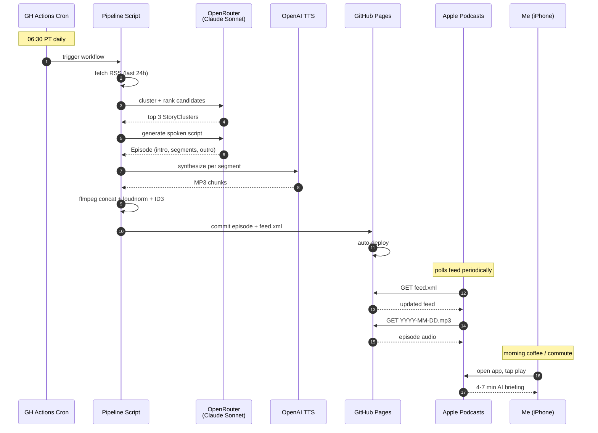

# Daily AI News Podcast — User Flow

## Daily flow (zero action required)

```
06:30 PT     GH Actions cron fires
06:30-06:35  Fetch RSS, curate, generate script
06:35-06:38  TTS + audio encode
06:38        Commit episode + updated feed.xml; GH Pages deploys
06:39+       Apple Podcasts polls feed (varies; usually <2hr)
~07-08 AM    New episode lands on iPhone
~08:00       I open Apple Podcasts during coffee/commute and play
```



## One-time setup flow

1. Build and deploy the repo (Claude Code session)
2. Trigger the workflow manually via Actions UI to confirm a clean run
3. Confirm `feed.xml` is reachable: `curl https://USER.github.io/ai-briefing/feed.xml`
4. Validate at [castfeedvalidator.com](https://castfeedvalidator.com) — paste the URL, fix any errors before subscribing
5. On iPhone:
   - Open Apple Podcasts
   - Library tab → top-right menu (•••) → **Follow a Show by URL**
   - Paste `https://USER.github.io/ai-briefing/feed.xml`
   - Tap **Follow**
6. Tap the show → settings gear → enable **Auto Download** and **Notify When New Episode**

## Listening flow

- New episode appears in Library overnight
- Tap to play; works on lock screen, CarPlay, AirPods
- Skip 30s, 1.5x speed, queue, mark as played — all native
- Listened state syncs across devices via iCloud

## Failure flow

- GH Actions sends a workflow-failure email to the repo owner by default
- Optional v1.5: add a second job that pings a Slack/Discord webhook on failure
- No episode appears that morning — correct behavior; broken episode is worse than missing one
- Manual recovery: open Actions tab → re-run the failed run after fixing root cause

## What the morning feels like

- Pick up phone → Apple Podcasts already shows "AI Briefing" with a fresh episode dated today
- Tap → 4-7 minutes of context-rich AI news while making coffee or driving
- No tab management, no email triage, no doom-scroll
- Episode auto-marks as played; tomorrow it just happens again
