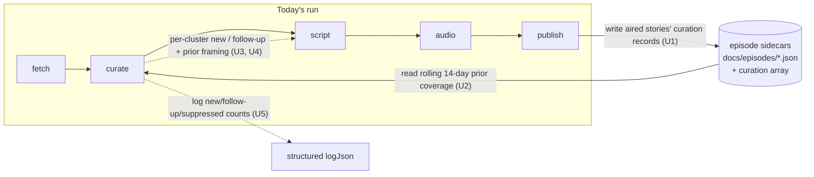

# feat: Cross-Episode Memory Ledger & Story Threading

## Summary

Give `curate` memory of recently aired stories so it suppresses already-covered items and threads genuine developments as follow-ups. Persist a per-story curation record in each episode sidecar, load a rolling ~14-day window of those records before curation, let the curate LLM decide matches/developments in-context (biased toward surfacing), pass a recurring-vs-new signal into the script step for continuity narration, and keep the whole path non-blocking so a missing ledger degrades to today's cold behavior.

---

## Problem Frame

`curate` runs cold every run — its prompt sees only the last 24h of articles (`src/curate.ts:154-177`). The `canonicalKey` the LLM already emits per cluster (`src/curate.ts:28-30`) is never persisted or read back, and episode sidecars store only presentation fields (`src/publish.ts:16-29`). So multi-day stories re-land as new and burn one of 1–6 daily slots, and the briefing never delivers the delta. See origin for full framing.

---

## Key Technical Decisions

**KTD1. Extend the episode sidecar, not a separate ledger file.** Add an optional `curation` array to `EpisodeRecord` and read it back through the existing `loadAllRecords` enumeration (`src/publish.ts:247-260`). Reuses the read/write path already exercised every run; no new file format, no separate retention policy. (Resolves origin Outstanding Question "storage shape".)

**KTD2. The curate LLM matches and judges development in-context.** Recent ledger entries go into the curate prompt; the model matches recurrences semantically and decides thread-vs-suppress. No embeddings, no thresholds (origin KD1). The deferred embedding index (origin Scope Boundaries) is the fallback if this proves unreliable.

**KTD3. The ledger path is non-blocking.** Loading prior coverage is wrapped so a missing/empty/corrupt sidecar set yields an empty prior-coverage list and `curate` proceeds cold (origin KD5, R8). Memory accumulates from rollout forward — no backfill (origin R3).

**KTD4. Follow-up status rides on `StoryCluster`.** The curate output marks each surviving cluster as new or follow-up with a short prior-framing note; these optional fields flow curate → script the same way `importance` does today, so `script` finally sees recurrence context (it never sees `canonicalKey` today — `src/script.ts:291-306`).

---

## High-Level Technical Design

The feature closes the loop between `publish` (write) and `curate` (read) across runs:

Directional; the prose and unit specs are authoritative.

---

## Implementation Units

### U1. Persist curation records in the episode sidecar

**Goal:** Each episode's aired stories are written to its sidecar with the fields threading needs.
**Requirements:** R1, R3.
**Dependencies:** none.
**Files:** `src/types.ts` (extend `EpisodeRecord` with optional `curation: CurationRecord[]`; add `CurationRecord` = `canonicalKey, headline, whyItMatters, caveat, importance, category`), `src/publish.ts` (populate from the aired clusters during record construction, `:118-135`), `src/index.ts` (ensure the selected `StoryCluster[]` reach `publish` — confirm the orchestrator passes clusters/episode through to the publish step), `test/publish.curation-record.test.ts`.
**Approach:** Derive `CurationRecord[]` from the selected clusters at publish time; field is optional so older records and the no-story-aired case stay valid. Keep `canonicalKey` verbatim from curate. Trace the curate → script → publish data flow first (`src/index.ts:30-47`) — if `publish` doesn't currently receive the clusters, thread them (or a derived curation summary) through; do not re-derive curation in `publish`.
**Patterns to follow:** existing `EpisodeRecord` construction and JSON write in `src/publish.ts`; optional-field handling like `importance?` on `StoryCluster` (`src/types.ts:50-59`).
**Test scenarios:**
- Happy path: an episode with 3 aired clusters writes a sidecar whose `curation` array has 3 entries with matching `canonicalKey`/`importance`/`category`.
- Edge: a record written without curation data (or zero aired stories) still parses and round-trips (field optional).
- Edge: `canonicalKey` is preserved exactly (kebab slug not mutated).
**Verification:** running publish for a sample episode produces a sidecar JSON containing the `curation` array; `npm run build` is clean.

### U2. Load a rolling ~14-day prior-coverage window

**Goal:** A non-blocking loader returns recent aired-story records for curation to reason over.
**Requirements:** R2, R3, R8.
**Dependencies:** U1.
**Files:** `src/ledger.ts` (new: `loadRecentCoverage(today, windowDays = 14)` returning `CurationRecord[]` with source episode date), `src/episode-date.ts` (date-window helper if not already expressible), `test/ledger.test.ts`.
**Approach:** Enumerate sidecars via the existing `loadAllRecords` mechanism (`src/publish.ts:247-260`), filter by date within the window, flatten their `curation` arrays. Wrap file reads/parse so any missing/corrupt file is skipped, not thrown — empty result is a valid outcome.
**Patterns to follow:** `loadAllRecords` enumeration + the `^\d{4}-\d{2}-\d{2}\.json$` match; `resolveEpisodeDate`/date math in `src/episode-date.ts:1-17`.
**Test scenarios:**
- Happy path: given sidecars across 20 days, only records within 14 days are returned, newest-first or dated.
- Edge: no sidecars / empty dir → returns `[]`.
- Error path (Covers AE4): a malformed JSON sidecar in range is skipped and the rest still load; no throw.
- Edge: records lacking a `curation` field contribute nothing and don't error (historical episodes).
**Verification:** unit tests pass; loader never throws on bad input.

### U3. Feed prior coverage into curate and decide thread vs suppress

**Goal:** `curate` uses recent coverage to suppress already-covered stories and mark genuine developments as follow-ups, biased toward surfacing.
**Requirements:** R4, R5, R6.
**Dependencies:** U2.
**Files:** `src/curate.ts` (load coverage via U2; inject a compact "recently covered" block into the prompt `:107-113`/`:154-177`; extend the response schema and `StoryCluster` handling), `src/types.ts` (optional `followUp?: { priorDate: string; priorFraming: string }` on `StoryCluster`), `test/curate.prompt.test.ts` (extend), `test/curate.selection.test.ts` (extend).
**Approach:** Summarize each recent record to one compact line (canonicalKey, headline, prior caveat, date) so the article list isn't crowded. System-prompt instructions: match recurrences semantically; suppress already-covered unless materially developed; when uncertain, prefer a short follow-up over dropping; always surface a major escalation; emit `followUp` with prior framing when threading. `selectStoryClusters` (`src/curate.ts:121-131`) is unchanged — suppression is the LLM omitting the cluster; follow-ups flow through as normal scored clusters.
**Patterns to follow:** existing schema/JSON-mode response handling and `buildUserPrompt` in `src/curate.ts`; `withRetry`/`withHardTimeout` wrappers already around the curate call.
**Test scenarios:**
- Prompt: when prior coverage exists, the curate prompt contains the recently-covered block with the prior canonicalKeys; when empty, the block is omitted.
- Covers AE1: a recurrence with new corroboration is returned as a cluster carrying `followUp` with prior framing.
- Covers AE2: a restated-no-substance recurrence is absent from the selected set (suppressed), freeing the slot.
- Covers AE3: an ambiguous recurrence is surfaced as a follow-up rather than dropped (assert the bias instruction is present and a follow-up cluster survives in a representative parse).
- Selection: a follow-up cluster counts toward `MAX_STORIES`/the 1–6 budget like any story.
**Verification:** extended curate tests pass; `npm run build` clean.

### U4. Narrate follow-ups as continuity in the script step

**Goal:** Threaded stories are delivered as updates referencing prior framing, not re-introduced cold.
**Requirements:** R7.
**Dependencies:** U3.
**Files:** `src/script.ts` (include the recurring/new signal + `followUp.priorFraming` in `buildUserPrompt` `:291-306`; add a system-prompt instruction to narrate follow-ups as continuity), `test/script.threading.test.ts`.
**Approach:** Extend the per-story prompt block with a "Previously / follow-up" line when `followUp` is present; instruct the narrator to open such a story as an update ("the rumor we flagged Monday is now confirmed") rather than fresh. New stories are unchanged.
**Patterns to follow:** existing `buildUserPrompt` per-story block and persona system-prompt assembly in `src/script.ts`.
**Test scenarios:**
- Covers AE1: a cluster with `followUp` renders a prompt block containing the prior framing and a follow-up marker.
- Happy path: a cluster without `followUp` renders the current block unchanged (no "previously" line).
**Verification:** script prompt tests pass.

### U5. Log threading and suppression decisions

**Goal:** Each run records what was new, threaded, or suppressed so curation is inspectable after the fact.
**Requirements:** R9.
**Dependencies:** U3.
**Files:** `src/curate.ts` (emit a `logJson` summary), optionally `src/index.ts` (surface counts alongside the existing curate-step log `:30-38`), `test/curate.selection.test.ts` (extend if the count helper is unit-testable).
**Approach:** After selection, log counts of new vs follow-up surviving clusters and the count/keys suppressed relative to prior coverage, using the existing structured `logJson` shape per stage. No new logging framework.
**Patterns to follow:** existing per-stage `logJson` calls (e.g., `src/index.ts:30-38`).
**Test scenarios:**
- A small helper that computes {new, followUp, suppressed} counts from clusters + prior coverage returns correct tallies.
- `Test expectation: none` for the log emission itself if it isn't cleanly unit-testable — cover the count helper instead.
**Verification:** counts appear in run logs; unit test on the tally helper passes.

---

## Scope Boundaries

**In scope:** persistence (U1), rolling-window load (U2), curate-time thread/suppress decision (U3), continuity narration (U4), decision logging (U5).

**Deferred for later** (origin; each its own effort): embedding/semantic matching index; Friday week-in-review meta-episode; story-velocity ranking; one-tap relevance feedback.

**Deferred to Follow-Up Work:** none identified.

**Not in scope:** backfilling curation records for existing episodes (origin R3).

---

## Risks & Dependencies

- **Over-suppression (no human in loop).** Mitigated by the surface-when-uncertain bias (U3, origin KD2/R5) and the U5 decision log that makes silent drops auditable after the fact.
- **Prompt bloat / cost.** The recently-covered block competes with the article list for the curate prompt budget; keep entries to one compact line each (U3). Touches the cost-per-episode strategy metric — keep the window summary lean.
- **Data-flow gap.** `publish` may not currently receive the selected clusters; U1 must verify and thread them rather than re-deriving curation downstream.
- **In-context match reliability.** If semantic matching from prompt context proves weak, fall back to the deferred embedding index (KTD2) — not part of this plan.

---

## Sources / Research

- Grounding dossier (verified file:line): `src/curate.ts:11-12, 28-30, 49-52, 107-113, 121-131, 154-177, 180-186`; `src/publish.ts:16-29, 118-135, 247-260`; `src/script.ts:291-306`; `src/types.ts:50-59`; `src/episode-date.ts:1-17`; `src/index.ts:30-47`.
- Origin requirements: `docs/brainstorms/2026-06-17-cross-episode-memory-ledger-requirements.md`.
- Test convention: Node test runner via `tsx --test` (`package.json` `test:unit`); add new `*.test.ts` files to that script.
- External: news importance evolves across days with cluster source-entropy (arXiv 2402.10302).
