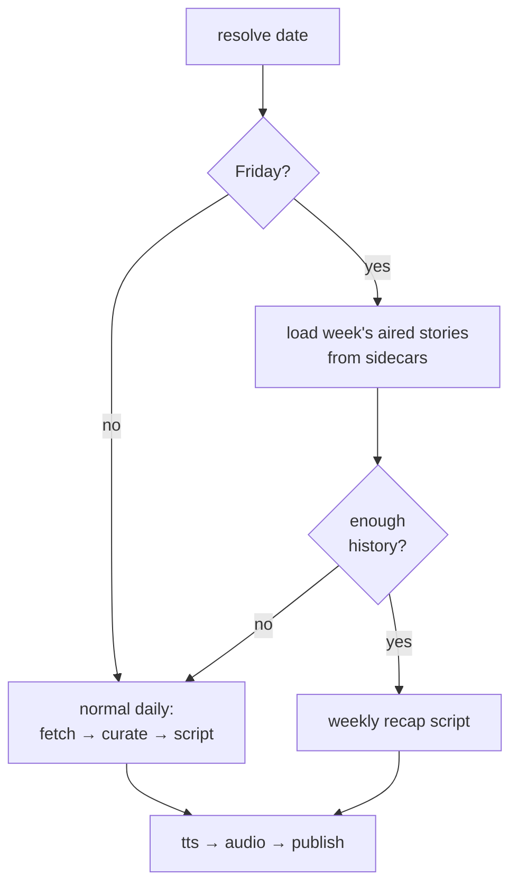

# feat: Friday week-in-review episode

## Summary

On Fridays, produce a "week in review" episode that synthesizes the week's already-aired stories into an arc — themes, threads, what developed — instead of running the normal daily. It reads the week's curation records from the episode sidecars (no new fetch or curation), generates a recap script, and runs it through the existing tts → audio → publish path as Friday's episode. If the week has too little aired material (a holiday/quiet week), it falls back to the normal daily pipeline. Mondays–Thursdays are unchanged.

---

## Problem Frame

The pipeline produces five independent daily episodes a week with no connective tissue. A daily listener gets snapshots but never the arc — which threads developed, what pattern ran through the week, what mattered most in aggregate. The week's episodes already persist structured curation records (M1: per-aired-story `canonicalKey`, `headline`, `whyItMatters`, `caveat`, `importance`, `category`), so the raw material for a synthesis already exists on disk and is paid for. A Friday recap turns that accumulated, otherwise-inert record into a second product shape at near-zero marginal cost — the clearest demonstration that the archive is an asset, not exhaust.

---

## Dependencies / Assumptions

- Builds on M1 (the `curation` sidecar field and the rolling-read pattern in `src/ledger.ts`). M1 is merged in main.
- Independent of M3/M9/M14/M16/velocity — touches the orchestrator branch and a new weekly-script path, not the daily scoring internals.
- No new datastore, no feed-shape change, no CI/workflow change (the weekly episode replaces Friday's daily on the same cadence).

---

## Key Technical Decisions

**KTD1. Friday-only, replaces the daily.** The weekday is derived from the resolved episode date (`src/episode-date.ts`, America/Los_Angeles). On Friday the run produces the recap *instead of* a normal daily, preserving one episode per weekday and the existing feed shape and numbering.

**KTD2. Synthesize from the ledger — no new fetch/curate.** Read the current week's aired stories from the episode sidecars' `curation` records (Monday–Thursday of the same week), reusing M1's tolerant rolling-read posture scoped to the week. The week's `whyItMatters`/`caveat`/`importance`/`category` are the synthesis inputs.

**KTD3. Skip-if-empty → fall back to the normal daily.** When the week has fewer than a small threshold of aired stories (holiday/quiet week, or early in a partial week), run the normal daily pipeline instead. Behavior-neutral on a thin or cold week.

**KTD4. The weekly episode is an ordinary feed item.** Same deterministic GUID-by-date, retention, and episode numbering as any episode; only the title and description differ ("AI Briefing — Week in Review"). No feed/numbering rework, no CI change.

**KTD5. The weekly script produces the same `Episode` shape.** A dedicated weekly-script generation path emits the existing `Episode` structure (intro/segments/outro chunks), so tts → audio → publish are reused unchanged. The recap is organized by theme/arc across the week rather than one-segment-per-story.

---

## High-Level Technical Design

The orchestrator forks once, on Friday-with-enough-history; both arms converge on the same tts/audio/publish tail:

Directional; the unit specs are authoritative.

---

## Implementation Units

### U1. Week-history loader + Friday detection

**Goal:** detect Friday from the episode date and load the current week's aired stories from the sidecars.
**Files:** `src/weekReview.ts` (new: `isFriday(date)`, `loadWeekCoverage(date)` returning the week's `CurationRecord`s with their episode dates), `src/episode-date.ts` (weekday helper if not already expressible), `test/weekReview.test.ts` (new).
**Approach:** reuse the `loadAllRecords`/window-filter pattern from `src/ledger.ts`, scoped to Monday–Thursday of `date`'s week. Non-blocking: missing/corrupt sidecars skipped. Pure date math (UTC/`episode-date` convention) — no DST surprises (string compare).
**Test scenarios:** `isFriday` true only on Fridays (incl. year boundary); `loadWeekCoverage` returns only the same week's Mon–Thu records; missing days → fewer records, no throw; corrupt sidecar skipped; empty week → empty result.
**Verification:** loader returns expected records on fixture sidecars in a temp dir.

### U2. Weekly recap script generation

**Goal:** turn the week's aired stories into a recap `Episode` organized by theme/arc.
**Dependencies:** U1.
**Files:** `src/script.ts` (new exported `writeWeeklyScript(date, weekStories)` + a weekly system/user prompt builder) or a new `src/weeklyScript.ts`, `test/script.weekly.test.ts` (new).
**Approach:** mirror `writeScript`/`buildSystemPrompt` conventions (persona, banned phrases, JSON-schema structured output, model fallback). The weekly prompt asks for an arc: opening that frames the week, theme-grouped segments referencing the week's stories and how threads developed, a synthesis outro. Emits the standard `Episode` shape (title "AI Briefing — Week in Review — <date>"). Keep the prompt builder pure/testable; no live LLM in tests.
**Test scenarios:** the weekly prompt includes the week's headlines/why-it-matters and asks for theme/arc structure; title carries the week-in-review marker; the prompt builder is hermetic; reuses the existing response schema so tts/audio/publish are unaffected.
**Verification:** prompt-builder unit tests pass; a constructed weekly `Episode` flows through the existing audio/publish path unchanged (type-level + a light integration check).

### U3. Orchestrator branch (Friday → weekly, else daily)

**Goal:** on Friday with enough week history, run the weekly path; otherwise the normal daily.
**Dependencies:** U1, U2.
**Files:** `src/index.ts` (branch after date resolution), `test/` (light orchestration coverage where feasible without live APIs).
**Approach:** if `isFriday(date)` and `loadWeekCoverage(date)` clears the threshold → weekly script path; else the existing fetch→curate→script path. Both converge on the existing tts→audio→publish calls. Keep `logJson` step markers (e.g., `pipeline.mode = "weekly" | "daily"`). Threshold lives as a named constant.
**Test scenarios:** Friday + enough history → weekly mode chosen; Friday + thin week → daily fallback; non-Friday → daily; the mode is logged. (Test the decision/selection logic in isolation from the live network stages.)
**Verification:** the branch selects the right mode for each case in a unit-level harness.

### U4. Title/description differentiation in publish

**Goal:** the weekly episode reads distinctly in the feed without changing feed mechanics.
**Dependencies:** U2.
**Files:** `src/publish.ts` (confirm the episode's own title/description flow through; add a week-in-review description if needed), `test/publish.curation-record.test.ts` or a small new test.
**Approach:** the weekly `Episode` already carries its own title (U2); confirm `publish` uses it verbatim and the description reads as a recap. No GUID/numbering/retention change. Persisting a `curation`/`curationReport` for the weekly episode is optional — note it does not feed the ledger meaningfully (it's a recap of already-recorded stories); keep the ledger's `curation` field semantics unchanged.
**Test scenarios:** a weekly episode's sidecar carries the week-in-review title/description; GUID-by-date and numbering unchanged; daily episodes unaffected.
**Verification:** sidecar + feed item for a weekly episode show the recap title; daily path byte-unchanged.

---

## Scope Boundaries

**In scope:** Friday detection + week loader (U1), weekly recap script (U2), orchestrator branch with skip-if-empty (U3), title/description differentiation (U4).

**Deferred to Follow-Up Work:** none required for a working feature.

**Not in scope:** a second/extra Friday episode (chose replace-the-daily); a fresh "biggest of the week" re-fetch (chose ledger-synthesis); any CI/workflow change (cadence is unchanged); month/quarter reviews.

---

## Risks & Dependencies

- **Thin or partial weeks.** Early-week holidays or missed runs leave little to recap. Mitigated by the skip-if-empty fallback (KTD3); the threshold should be conservative so a 2-story week still falls back to a daily rather than a hollow recap.
- **Week-boundary correctness.** "This week's Mon–Thu" must be computed consistently with the episode-date timezone. Mitigation: reuse `episode-date` conventions; cover the year boundary in U1 tests.
- **Recap quality is LLM-dependent.** Like the daily script, the arc quality is only observable in real episodes — worth listening to the first Friday or two. The prompt should lean on the week's `whyItMatters`/threads rather than re-summarizing headlines.
- **Manual re-run on a Friday** reproduces the weekly episode for that date (same GUID), which is the intended idempotent behavior.

---

## Sources / Research

- In-session grounding: `src/ledger.ts` (`loadAllRecords`, rolling-window read), `src/types.ts` (`CurationRecord`, `Episode`), `src/script.ts` (`writeScript`, prompt builders, response schema), `src/episode-date.ts` (date resolution), `src/publish.ts` (sidecar/feed, deterministic GUID/numbering).
- Origin idea: `docs/ideation/2026-06-17-open-ideation.html` (Friday week-in-review meta-episode).
- Related shipped feature: M1 (cross-episode memory ledger) supplies the week's curation records.
